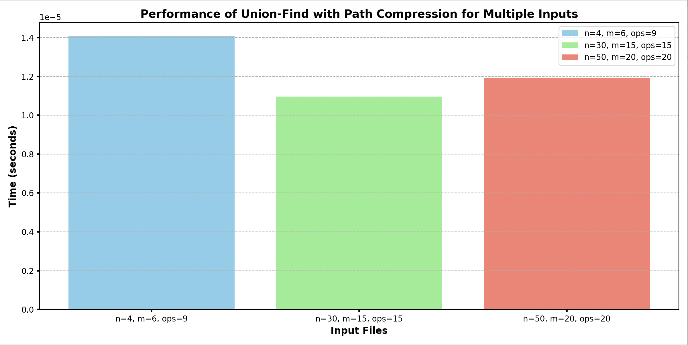

# Introduction To Algorithms CS-430 (Project)

## Contributors

- **Name:** Sudipta Banerjee
- **CWID:** A20460632
- **Email:** sbanerjee5@hawk.iit.edu

## Union-Find and Union-Find with Path Compression (Description)

This project implements two algorithms: Union-Find and Union-Find with Path Compression. These data structures are used to maintain disjoint sets and perform operations such as finding the representative element of a set and merging (unioning) two sets.

## Install External Libraries

```bash
pip install matplotlib
pip install numpy
```

## Algorithm Descriptions

### 1. Union-Find

The Union-Find data structure is utilized to manage a collection of disjoint (non-overlapping) sets. It supports two principal operations:

- **Union(x, y)**: Merges the sets containing elements `x` and `y` into a single set.
- **Find(x)**: Identifies the representative element (root) of the set that includes `x`.

This implementation employs the **Union by Rank** heuristic, which aims to maintain the tree as flat as possible by attaching the smaller tree (by rank) to the root of the larger tree during a union operation. The rank of a node provides an upper bound on the height of the node within the tree.

#### Implementation Details

- The `UnionFind` function initializes with `size` elements, each element initially being its own root with a rank of 0.
- The `find_root` function traces the parent pointers until it finds the root of the set containing the specified element, without path compression.
- The `union_rank` function first determines the roots of the sets containing `x` and `y`. If the roots differ, the sets are merged by attaching the root of the smaller ranked tree to the root of the higher ranked tree. If the ranks are equal, one root is arbitrarily chosen as the parent, and its rank is incremented.

### 2. Union-Find with Path Compression

The Union-Find with Path Compression algorithm enhances the basic Union-Find algorithm by incorporating path compression, which flattens the tree structure during the `find` operation, making subsequent operations faster.

#### Implementation Details

- The `UnionFindWithPathCompression` function is similar to the basic Union-Find but includes path compression during the find operation.
- The `find_root` function is optimized with path compression, whereby it compresses the path by setting the parent of each visited node directly to the root, effectively flattening the tree during the traversal.
- The `union_rank` function is the same as in the basic Union-Find and uses the Union by Rank heuristic to merge sets.

## Main function

The project includes a `main.py` file that serves as the entry point for executing the algorithms. It reads input from a file, processes the operations, and writes the output to another file.

## Run the Main Program (Union_find with Path Compression)

To run the program, use the following command:

```bash
python3 main.py -i <inputfile>
```

### Replace input_file with input.txt

```bash
python3 main.py -i input.txt
```

## Plot Performance Analysis

The `plot_operations.py` file contains code to analyze the performance of the Union-Find with Path Compression algorithm for multiple inputs. It measures the time taken for operations from input files and plots the results.

## Run the Program (Plot Performance)

To run the following functionality, use the following command:

```bash
python3 plot_operations.py
```

## Plotting function



## Download Report

.pdf)
